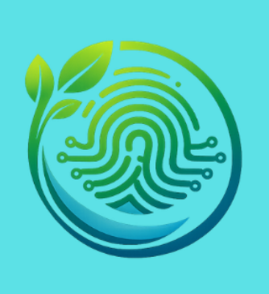
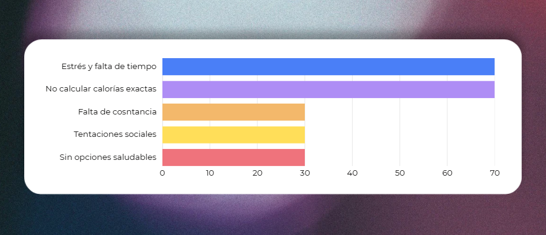
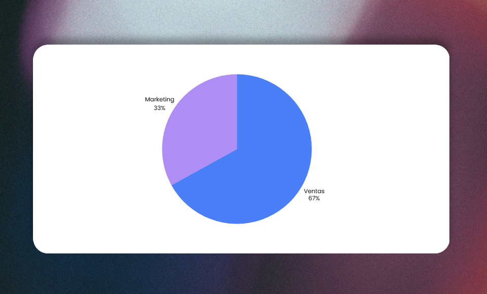
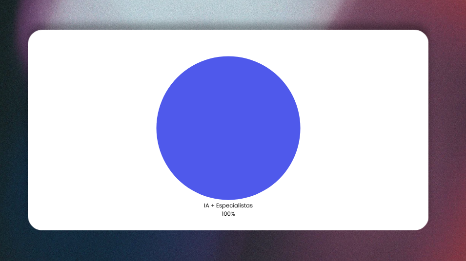
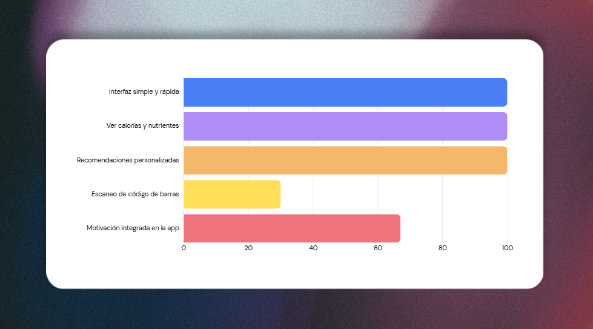
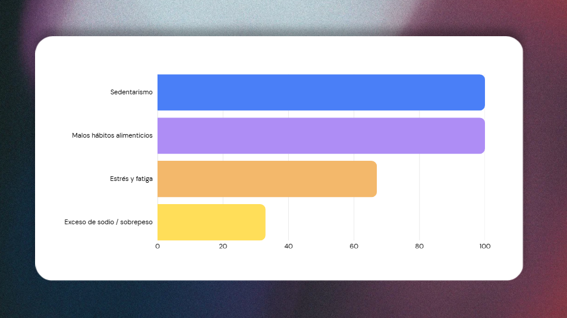
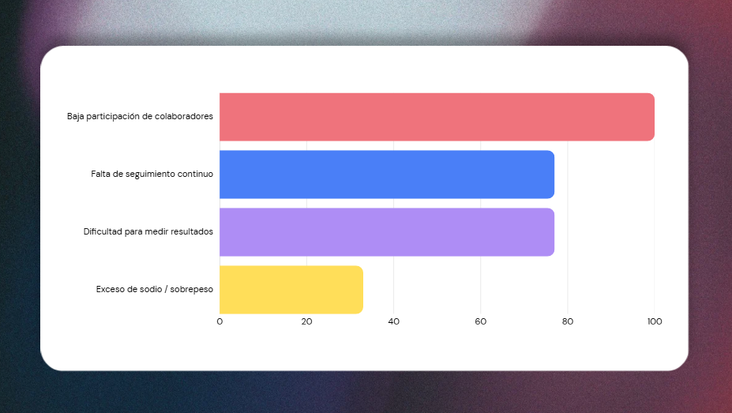
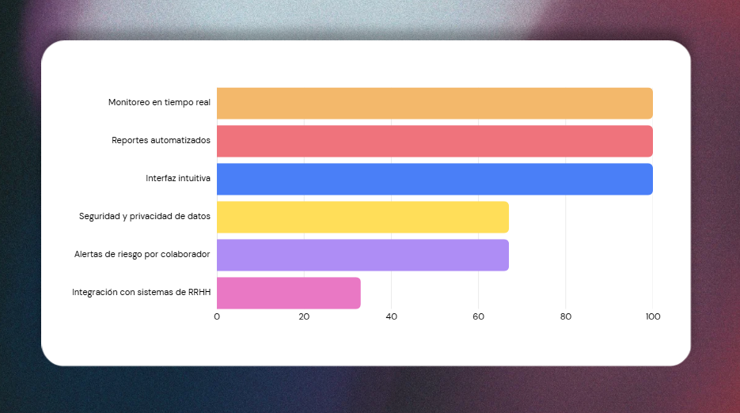

## Capitulo II: Requirements Elicitation & Analysis 

### 2.1. Competidores 

#### 2.1.1. 	Análisis competitivo 

  <table>
  <tr>
    <th colspan="6" valign="top">Competitive Analysis Landscape</th>
  </tr>
  <tr>
    <td colspan="2" valign="top">¿Por qué llevar a cabo este análisis?</td>
    <td colspan="4" valign="top">El objetivo de este análisis es identificar las características de los competidores y encontrar maneras de diferenciarnos.</td>
  </tr>
  <tr>
    <td colspan="2" rowspan="2" valign="top">Startup y Competidores</td>
    <td valign="top">Biotrack</td>
    <td valign="top">MyFitnessPal</td>
    <td valign="top">Yazio</td>
    <td valign="top">FitBit</td>
  </tr>
  <tr>
    <td valign="top"></td>
    <td valign="top"></td>
    <td valign="top"></td>
    <td valign="top"></td>
   </tr>
  <tr>
    <td rowspan="2" valign="top">Perfil</td>
    <td valign="top">Overview</td>
    <td valign="top">Plataforma web de gestión nutricional diseñada para pacientes y organizaciones que buscan mejorar el seguimiento de la salud y los hábitos alimenticios.</td>
    <td valign="top">Aplicación móvil de seguimiento de nutrición y fitness que permite registrar la ingesta de alimentos, el ejercicio y otros hábitos de bienestar.</td>
    <td valign="top">Aplicación móvil de seguimiento nutricional y planificación de comidas que ayuda a los usuarios a controlar su ingesta calórica, macronutrientes y hábitos alimenticios.</td>
    <td valign="top">Aplicación móvil de salud y fitness desarrollada por Google LLC que permite registrar y analizar la actividad física, el sueño, la nutrición y el bienestar general del usuario.</td>
  </tr>
  <tr>
    <td valign="top">Ventaja competitiva ¿Qué valor ofrece a los clientes?</td>
    <td valign="top">Gestión nutricional integral, seguimiento en tiempo real, integración con dispositivos IoT, análisis de datos y dashboards, enfoque en pacientes y empresas, información centralizada, toma de decisiones basada en datos.</td>
    <td valign="top">Registro de alimentos y calorías, base de datos amplia, seguimiento diario de dieta, control de objetivos personales, interfaz sencilla.</td>
    <td valign="top">Planes alimenticios predefinidos, seguimiento de peso y hábitos, enfoque en pérdida de peso, ayuno intermitente, interfaz visual y fácil de usar.</td>
    <td valign="top">Monitoreo con dispositivos wearables, datos en tiempo real, seguimiento de actividad física y signos vitales, métricas automáticas, enfoque en salud física.</td>
  </tr>
  <tr>
    <td rowspan="2" valign="top">Perfil de Marketing</td>
    <td valign="top">Mercado objetivo</td>
    <td valign="top">Pacientes, usuarios de salud digital, empresas con programas de bienestar.</td>
    <td valign="top">Usuarios fitness, personas que controlan calorías.</td>
    <td valign="top">Personas que buscan bajar de peso, usuarios de dietas.</td>
    <td valign="top">Usuarios de wearables, personas activas y fitness.</td>
  </tr>
  <tr>
    <td valign="top">Estrategias de marketing</td>
    <td valign="top">Marketing digital, alianzas con empresas, enfoque en salud preventiva, demostraciones del sistema, contenido educativo.</td>
    <td valign="top">Marketing en redes sociales, comunidad fitness, versión gratuita, recomendaciones y retos.</td>
    <td valign="top">    <td valign="top">Contenido en redes, influencers de fitness, enfoque en pérdida de peso, planes premium, retos y guías.</td>
    </td>
    <td valign="top">Venta de dispositivos, integración app + hardware, retos y logros, comunidad activa, branding en salud y fitness.</td>
  </tr>
  <tr>
    <td rowspan="3" valign="top">Perfil de Producto</td>
    <td valign="top">Productos & Servicios</td>
    <td valign="top">Gestión nutricional, creación de planes alimenticios, monitoreo del progreso, dashboards y reportes, análisis de datos, integración con dispositivos IoT, acceso multiplataforma.</td>
    <td valign="top">Registro de alimentos, conteo de calorías, base de datos nutricional, seguimiento de dieta, objetivos personalizados, versión gratuita y premium.</td>
    <td valign="top">Planes alimenticios, seguimiento de peso, programas de dieta, ayuno intermitente, control de hábitos, versión gratuita y premium.</td>
    <td valign="top">Monitoreo de actividad física, registro de signos vitales, integración con wearables, métricas en tiempo real, app móvil, suscripción premium.</td>
  </tr>
  <tr>
    <td valign="top">Precios & Costos</td>
    <td valign="top">Suscripción mensual o anual, planes diferenciados para pacientes y empresas, costo escalable según funcionalidades y número de usuarios.</td>
    <td valign="top">Modelo freemium, versión gratuita con funciones básicas, suscripción premium con funciones avanzadas.</td>
    <td valign="top">Modelo freemium, acceso gratuito limitado, planes premium con funcionalidades completas.</td>
    <td valign="top">Venta de dispositivos wearables, app gratuita, suscripción premium para análisis avanzado y funciones adicionales.</td>
  </tr>
  <tr>
    <td valign="top">Canales de distribución (Web y/o Móvil)</td>
    <td valign="top">Aplicación web, acceso desde navegadores, multiplataforma, futura integración móvil.</td>
    <td valign="top">Aplicación móvil (iOS y Android), versión web complementaria.</td>
    <td valign="top">Aplicación móvil (iOS y Android), acceso web limitado.</td>
    <td valign="top">Aplicación móvil (iOS y Android), integración con dispositivos wearables, versión web complementaria.</td>
  </tr>
  <tr>
    <td rowspan="4" valign="top">Análisis SWOT</td>
    <td valign="top">Fortalezas</td>
    <td valign="top">Plataforma integral, centralización de datos, seguimiento en tiempo real, enfoque en pacientes y empresas, análisis mediante dashboards, escalabilidad.</td>
    <td valign="top">Amplia base de usuarios, base de datos alimenticia extensa, facilidad de uso, posicionamiento en el mercado, modelo freemium.</td>
    <td valign="top">Interfaz intuitiva, planes alimenticios estructurados, enfoque en pérdida de peso, experiencia de usuario amigable, acceso freemium.</td>
    <td valign="top">Integración con hardware, monitoreo en tiempo real, datos precisos, fuerte reconocimiento de marca, ecosistema tecnológico.</td>
  </tr>
  <tr>
    <td valign="top">Oportunidades </td>
    <td valign="top">Crecimiento health-tech, adopción IoT, demanda empresarial, digitalización de salud. </td>
    <td valign="top">Crecimiento fitness, funciones premium, integración tecnológica.</td>
    <td valign="top">Tendencia en dietas, mercado fitness, expansión de servicios.</td>
    <td valign="top">Crecimientos wearables, innovación en salud, alianzas estratégicas.</td>
  </tr>
  <tr>
    <td valign="top">Debilidades</td>
    <td valign="top">Dependencia del registro constante, adopción inicial baja, necesidad de integración IoT, confianza en datos.</td>
    <td valign="top">Registro manual tedioso, poca personalización clínica, enfoque limitado, dependencia del usuario.</td>
    <td valign="top">Planes poco personalizados, funciones limitadas gratis, baja profundidad analítica.</td>
    <td valign="top">Dependencia de dispositivos, costo elevado, enfoque limitado en nutrición.</td>
  </tr>
  <tr>
    <td valign="top">Amenazas</td>
    <td valign="top">Competencia posicionada, desconfianza en datos de salud, baja adopción inicial, cambios tecnológicos.</td>
    <td valign="top">Alta competencia, pérdida de usuarios, cambios en tendencias fitness.</td>
    <td valign="top">Competencia similar, saturación del mercado, baja diferenciación.</td>
    <td valign="top">Competencia en wearables, avances tecnológicos rápidos, dependencia del hardware.</td>
  </tr>
  <tr>
    <td rowspan="4" valign="top">Precios y costos</td>
    <td valign="top">Costo Anual</td>
    <td valign="top">Plan básico S/239–359/año, plan premium S/479–659/año, plan empresarial S/2,388–8,388/año, precios escalables según usuarios y funcionalidades.</td>
    <td valign="top">Gratis (básico), premium S/296–370/año aprox. ($79.99–$99.99/año)</td>
    <td valign="top">Gratis (básico), premium S/88–177/año aprox. ($23.90–$47.90/año)</td>
    <td valign="top">App gratuita, premium S/296–370/año aprox., costo adicional de dispositivos wearables (pago único).</td>
  </tr>
  <tr>
    <td valign="top">Mensual</td>
    <td valign="top">Plan básico S/19.90–29.90/mes, plan premium S/39.90–54.90/mes, plan empresarial S/199–699/mes.</td>
    <td valign="top">Gratis (básico), premium S/37–92/mes aprox. ($9.99–$24.99/mes)</td>
    <td valign="top">Gratis (básico), premium S/7–30/mes aprox. ($1.99–$8/mes dependiendo del plan) </td>
    <td valign="top">App gratuita, premium S/37–55/mes aprox. ($9.99–$14.99/mes), adicional costo de dispositivos.</td>
  </tr>
</table>

## 2.1.2. Estrategias y tácticas frente a competidores

#### **Estrategia Competitiva**

 **1. Integración de monitoreo en tiempo real y análisis de datos**

BioTrack se diferenciará al integrar el seguimiento nutricional con monitoreo en tiempo real y análisis de datos mediante dashboards, permitiendo una visión más completa del estado de salud del usuario.  

Esta estrategia surge del cruce entre:  
- **Fortalezas:** Centralización de datos y capacidad de análisis  
- **Oportunidades:** Crecimiento del mercado health-tech e IoT  

Al ofrecer información continua y precisa, BioTrack mejorará la toma de decisiones y se posicionará frente a soluciones que solo brindan seguimiento manual o parcial.

---

 **2. Enfoque en el mercado corporativo**
 
BioTrack aprovechará la oportunidad de atender a empresas que buscan mejorar el bienestar de sus colaboradores, ofreciendo herramientas de monitoreo grupal y reportes agregados.  

Esta estrategia nace del cruce entre:  
- **Fortalezas:** Plataforma integral  
- **Oportunidades:** Interés empresarial en salud preventiva  

De esta manera, se cubrirá un segmento poco atendido por competidores enfocados en usuarios individuales, ampliando el alcance del producto.

---

### **Estrategia de cercanía con el cliente**

#### **1. Incentivar el uso constante mediante seguimiento y visualización**
BioTrack implementará recordatorios inteligentes y una visualización clara del progreso para motivar a los usuarios a registrar su información de forma continua.  

Esta estrategia responde al cruce entre:  
- **Debilidades:** Dependencia del registro constante  
- **Oportunidades:** Uso de tecnología digital  

Al mejorar la experiencia del usuario, se reducirá el abandono y se incrementará la fidelización.

---

#### **2. Alianzas con profesionales de la salud y organizaciones**
BioTrack establecerá alianzas con nutricionistas, clínicas y empresas para fortalecer la credibilidad de la plataforma y ampliar su adopción.  

Esta estrategia surge del cruce entre:  
- **Fortalezas:** Gestión centralizada de información  
- **Oportunidades:** Expansión en el sector salud  

A través de estas alianzas, se logrará ofrecer un servicio más confiable y respaldado por expertos.
 
## 2.2. Entrevistas

### 2.2.1. Diseño de entrevistas

#### **Segmento 1: Pacientes**

  **Introducción :**

Buenos días/tardes/noches.  
Mi nombre es […], soy estudiante de la Universidad Peruana de Ciencias Aplicadas (UPC) y actualmente estudio la carrera de Ingeniería de Software.

Junto con mi equipo, estamos desarrollando un proyecto llamado **BioTrack**, una plataforma orientada a mejorar la gestión nutricional y el seguimiento de la salud.

**Preguntas introductorias:**

Antes de comenzar, me gustaría comentarte que la información que nos brindes será utilizada únicamente con fines académicos.

Para empezar, me gustaría conocerte un poco:

- ¿Podrías indicarme tu nombre (o cómo prefieres que te llame), tu edad y el distrito donde resides?

Ahora sí, comenzamos:

 **Preguntas principales:**

1. ¿Cómo sueles organizar tu alimentación en tu día a día?  
2. ¿Qué dificultades has tenido al intentar seguir una dieta o plan nutricional?  
3. ¿Has utilizado alguna aplicación o servicio para mejorar tu alimentación? ¿Cómo fue tu experiencia?  
4. ¿Qué tan importante es para ti llevar un seguimiento de tu salud (peso, calorías, hábitos)?  
5. ¿Qué te motiva o desmotiva a mantener hábitos alimenticios saludables?  
6. ¿Cómo te sentirías si una plataforma te ayudara a monitorear tu progreso en tiempo real?  
7. ¿Qué tipo de información te gustaría ver sobre tu salud o alimentación?  
8. ¿Confías en recomendaciones nutricionales automatizadas o prefieres siempre un especialista? ¿Por qué?  
9. ¿Qué tan dispuesto estarías a pagar una suscripción por una herramienta que mejore tu alimentación?  
10. ¿Qué características consideras indispensables en una app de nutrición para que realmente la uses?  

**Cierre :**

Muchas gracias por tu tiempo y por compartir tu experiencia, ha sido de gran ayuda para nuestro proyecto.

---

#### **Segmento 2: Empresas**

 **Introducción :**

Buenos días/tardes/noches.  
Mi nombre es […], soy estudiante de la Universidad Peruana de Ciencias Aplicadas (UPC) y actualmente estudio la carrera de Ingeniería de Software.

Junto con mi equipo, estamos desarrollando un proyecto llamado **BioTrack**, una plataforma orientada a mejorar la gestión nutricional y el seguimiento de la salud.

 **Preguntas introductorias:**

Antes de comenzar, me gustaría comentarte que la información que nos brindes será utilizada únicamente con fines académicos.

Para empezar, me gustaría conocerte un poco:

- ¿Podrías indicarme tu nombre (o cómo prefieres que te llame), tu edad y el distrito donde resides?

Ahora sí, comenzamos:

 **Preguntas principales:**

1. ¿Qué acciones realiza actualmente su empresa para promover la salud y bienestar de sus colaboradores?  
2. ¿Qué problemas han identificado relacionados con la alimentación o salud de su personal?  
3. ¿Cómo hacen seguimiento actualmente al bienestar de sus colaboradores?  
4. ¿Han utilizado alguna herramienta digital para este tipo de seguimiento? ¿Cómo fue su experiencia?  
5. ¿Qué tan importante es para su empresa contar con información actualizada sobre la salud de sus trabajadores?  
6. ¿Qué tipo de datos o reportes le gustaría obtener sobre el estado de sus colaboradores?  
7. ¿Qué dificultades encuentran al implementar programas de bienestar o nutrición?  
8. ¿Cómo toman decisiones relacionadas con la salud y bienestar dentro de la empresa?  
9. ¿Qué tan dispuestos estarían a invertir en una plataforma que les permita monitorear la salud de sus colaboradores?  
10. ¿Qué características consideran indispensables en una solución como BioTrack?  
 
### 2.2.2. 	Registro de entrevistas 

- #### **Segmento 1 : Pacientes**
<table>
  <tr>
    <th colspan="2">Entrevista 1:</th>
  </tr>

  <tr>
    <td colspan="2">
      
    </td>
  </tr>

  <tr>
    <td>
      <strong>Entrevistado:</strong> Catherine Villar 
      <strong>Entrevistador(a):</strong> Sofía Díaz Yurivilca 
      <strong>Duración:</strong> 7:16
    </td>
    <td>
      <strong>Género:</strong> Femenino 
      <strong>Edad:</strong> 21 
      <strong>Lugar de Residencia:</strong> San Martín de Porres
    </td>
  </tr>

  <tr>
    <td colspan="2">
      <strong>Link de la entrevista:</strong> 
      <a href="https://upcedupe-my.sharepoint.com/:v:/g/personal/u20241a195_upc_edu_pe/IQCZUWmxeLYgRYQglNeChDxZAbqG3YT0fIX7NEFRkvz64F0?e=1n1Ihe">NexTech Entrevista 1</a>
    </td>
  </tr>

  <tr>
    <td colspan="2">
      <strong>Resumen:</strong>  

      Catherine Villar, de 21 años y residente en San Martín de Porres, presenta dificultades para mantener una alimentación organizada debido a la falta de tiempo y la carga académica. Aunque reconoce la importancia de llevar un seguimiento de su salud, no lo realiza de forma constante, principalmente por falta de disciplina y por la complejidad de algunas aplicaciones que ha probado.

      Ha utilizado herramientas digitales para registrar su alimentación, pero las ha abandonado por resultar repetitivas y demandar mucho tiempo. Su principal problema es la falta de constancia, influenciada por el estrés y la ausencia de opciones saludables accesibles.

      La entrevistada valora positivamente una plataforma que le permita monitorear su progreso en tiempo real, siempre que sea fácil de usar, rápida y no interfiera con su rutina. Además, muestra disposición a pagar por una solución si percibe un beneficio real. Considera importante que la aplicación ofrezca información clara, recomendaciones útiles y un enfoque práctico que motive el uso continuo.

  </tr>
</table>

<table>
  <tr>
    <th colspan="2">Entrevista 2:</th>
  </tr>

  <tr>
    <td colspan="2">
      
    </td>
  </tr>

  <tr>
    <td>
      <strong>Entrevistado:</strong>Gonzalo Daniel Alberto de la Cruz Pérez 
      <strong>Entrevistador(a):</strong> Sofía Díaz Yurivilca 
      <strong>Duración:</strong> 7:33
    </td>
    <td>
      <strong>Género:</strong> Masculino
       
      <strong>Edad:</strong> 27 
      <strong>Lugar de Residencia:</strong> Huaraz
    </td>
  </tr>

  <tr>
    <td colspan="2">
      <strong>Link de la entrevista:</strong> 
      <a href="https://upcedupe-my.sharepoint.com/:v:/g/personal/u20241a195_upc_edu_pe/IQABDZdfcO6bQ46rgVqAyjtxAVl_jvHtLZ9r4i_Ro9mmjGM?e=mdaG9T">NexTech Entrevista 3</a>
    </td>
  </tr>

  <tr>
    <td colspan="2">
      <strong>Resumen:</strong>  

     El entrevistado organiza su alimentación semanal junto a su familia, lo que le permite tener cierto orden; sin embargo, presenta dificultades al momento de medir con precisión las calorías y nutrientes de los alimentos que consume. Ha utilizado aplicaciones previamente, pero considera que estas son poco precisas y limitadas, lo que reduce su utilidad. 
     
     Destaca la importancia de llevar un seguimiento de su salud, aunque reconoce que no lo realiza de manera constante. Se siente motivado por mejorar su bienestar físico, pero se desmotiva ante dietas estrictas. Considera que una plataforma con monitoreo en tiempo real sería muy útil, especialmente si automatiza el registro de información. 
     
     Asimismo, le gustaría visualizar datos como calorías, nutrientes, evolución de peso y recibir recomendaciones personalizadas. Está dispuesto a pagar por una herramienta siempre que este aporte valor real. Finalmente, resalta que una aplicación debe ser intuitiva, clara y no saturar al usuario con demasiada información para asegurar su uso continuo.

  </tr>
</table>

<table>
  <tr>
    <th colspan="2">Entrevista 1:</th>
  </tr>

  <tr>
    <td colspan="2">
      
    </td>
  </tr>

  <tr>
    <td>
      <strong>Entrevistado:</strong>Catherine Villar 
      <strong>Entrevistador(a):</strong> Sofía Díaz Yurivilca 
      <strong>Duración:</strong> 7:16
    </td>
    <td>
      <strong>Género:</strong>Masculino 
      <strong>Edad:</strong> 21 
      <strong>Lugar de Residencia:</strong> San Martín de Porres
    </td>
  </tr>

  <tr>
    <td colspan="2">
      <strong>Link de la entrevista:</strong> 
      <a href="https://upcedupe-my.sharepoint.com/:v:/g/personal/u20241a195_upc_edu_pe/IQBJhEtjNKlNQpfpZOzA6WyMAegaGqWau48Z__B5YwZbBIQ?e=GKIWgv">NexTech Entrevista 1</a>
    </td>
  </tr>

  <tr>
    <td colspan="2">
      <strong>Resumen:</strong>  

     El entrevistado organiza su alimentación mediante un horario manual en Word, donde detalla cantidades y horarios de comida. Señala como principal dificultad la falta de una herramienta centralizada que le ayude a calcular y gestionar su dieta, además de la influencia de su rutina social y universitaria. Ha utilizado aplicaciones de conteo de calorías, pero su experiencia fue negativa debido a las limitaciones en las versiones gratuitas. Considera importante el seguimiento de su salud, especialmente por su estilo de vida sedentario asociado al uso constante de la computadora. 
     
     En cuanto a motivación, busca mejorar su salud tras haber tenido malos hábitos en el pasado, aunque a veces se desmotiva por restricciones alimenticias. Valora positivamente una plataforma que permita monitoreo en tiempo real y estaría dispuesto a usarla si se adapta a sus necesidades. Prefiere una combinación de recomendaciones automatizadas y asesoría profesional. Además, estaría dispuesto a pagar una suscripción si ofrece beneficios claros. Finalmente, destaca como características clave el escaneo de códigos de barras, un buscador de alimentos, estimaciones con IA y validación profesional.
  </tr>
</table>

#### **Segmento #2: Empresas**

<table>
  <tr>
    <th colspan="2">Entrevista 1:</th>
  </tr>

  <tr>
    <td colspan="2">
      
    </td>
  </tr>

  <tr>
    <td>
      <strong>Entrevistado:</strong> Antonio Cortez 
      <strong>Entrevistador(a):</strong> Sofía Díaz Yurivilca 
      <strong>Duración:</strong> 5:45
    </td>
    <td>
      <strong>Género:</strong>Masculino 
      <strong>Edad:</strong> 29 
      <strong>Lugar de Residencia:</strong> El Callao
    </td>
  </tr>

  <tr>
    <td colspan="2">
      <strong>Link de la entrevista:</strong> 
      <a href="https://upcedupe-my.sharepoint.com/:v:/g/personal/u20241a195_upc_edu_pe/IQDuBgcvvzeGSYNO0-SvTHRzAb7wyjhQuo725RWkdN6nMfI?e=exojmq">NexTech Entrevista 4</a>
    </td>
  </tr>

  <tr>
    <td colspan="2">
      <strong>Resumen:</strong>  

    El entrevistado organiza su alimentación semanal junto a su familia, lo que le permite tener cierto orden; sin embargo, presenta dificultades al momento de medir con precisión las calorías y nutrientes de los alimentos que consume. Ha utilizado aplicaciones previamente, pero considera que estas son poco precisas y limitadas, lo que reduce su utilidad. 
    
    Destaca la importancia de llevar un seguimiento de su salud, aunque reconoce que no lo realiza de manera constante. Se siente motivado por mejorar su bienestar físico, pero se desmotiva ante dietas estrictas. Considera que una plataforma con monitoreo en tiempo real sería muy útil, especialmente si automatiza el registro de información. 
    
    Asimismo, le gustaría visualizar datos como calorías, nutrientes, evolución de peso y recibir recomendaciones personalizadas. Está dispuesto a pagar por una herramienta siempre que este aporte valor real. Finalmente, resalta que una aplicación debe ser intuitiva, clara y no saturar al usuario con demasiada información para asegurar su uso continuo. 
  </tr>
</table>

 <table>
  <tr>
    <th colspan="2">Entrevista 2:</th>
  </tr>

  <tr>
    <td colspan="2">
      
    </td>
  </tr>

  <tr>
    <td>
      <strong>Entrevistado:</strong>Pamela Beltran 
      <strong>Entrevistador(a):</strong> Sofía Díaz Yurivilca 
      <strong>Duración:</strong> 7:10
    </td>
    <td>
      <strong>Género:</strong>Masculino 
      <strong>Edad:</strong> 28 
      <strong>Lugar de Residencia:</strong> San Miguel
    </td>
  </tr>

  <tr>
    <td colspan="2">
      <strong>Link de la entrevista:</strong> 
      <a href="https://upcedupe-my.sharepoint.com/:v:/g/personal/u20241a195_upc_edu_pe/IQCbuYwJkTaeSbZpYfVeD4X5AU9aCf1qY23KaTRko4epAJw?e=xXpp0c">NexTech Entrevista 4 
     </a>
    </td>
  </tr>

  <tr>
    <td colspan="2">
      <strong>Resumen:</strong>  

     La entrevistada indica que su empresa realiza acciones básicas para promover el bienestar, como pausas activas, chequeos de salud y convenios con gimnasios, aunque carecen de un programa estructurado. Ha identificado problemas como malos hábitos alimenticios, sedentarismo, consumo frecuente de dulces, estrés y fatiga, los cuales afectan la productividad. 
     
     El seguimiento del bienestar es limitado, basado principalmente en reportes de recursos humanos, ausentismo y encuestas ocasionales. Han utilizado herramientas digitales simples como formularios, pero sin resultados realmente útiles o accionables. Considera muy importante contar con información actualizada, ya que impacta directamente en la productividad, el clima laboral y la reducción de ausencias. 
     
     Le gustaría contar con indicadores sobre estrés, hábitos alimenticios, actividad física y riesgos de salud, además de reportes segmentados por equipos. Entre las principales dificultades menciona la baja participación de los colaboradores y la falta de continuidad en el seguimiento. 
     
     Las decisiones actuales se basan en datos generales y no en información en tiempo real. La empresa estaría dispuesta a invertir en una plataforma si demuestra impacto en productividad, reducción de costos y mejora del clima laboral. Finalmente, considera indispensables características como facilidad de uso, reportes en tiempo real, alertas de riesgo, integración con sistemas de recursos humanos, protección de datos y recomendaciones personalizadas para los colaboradores. 

  </tr>
</table>

<tr>
    <td colspan="2">
      <strong>Resumen:</strong>  

    El entrevistado organiza su alimentación semanal junto a su familia, lo que le permite tener cierto orden; sin embargo, presenta dificultades al momento de medir con precisión las calorías y nutrientes de los alimentos que consume. Ha utilizado aplicaciones previamente, pero considera que estas son poco precisas y limitadas, lo que reduce su utilidad. 
    
    Destaca la importancia de llevar un seguimiento de su salud, aunque reconoce que no lo realiza de manera constante. Se siente motivado por mejorar su bienestar físico, pero se desmotiva ante dietas estrictas. Considera que una plataforma con monitoreo en tiempo real sería muy útil, especialmente si automatiza el registro de información. 
    
    Asimismo, le gustaría visualizar datos como calorías, nutrientes, evolución de peso y recibir recomendaciones personalizadas. Está dispuesto a pagar por una herramienta siempre que este aporte valor real. Finalmente, resalta que una aplicación debe ser intuitiva, clara y no saturar al usuario con demasiada información para asegurar su uso continuo. 
  </tr>
</table>

 <table>
  <tr>
    <th colspan="2">Entrevista 3:</th>
  </tr>

  <tr>
    <td colspan="2">
      
    </td>
  </tr>

  <tr>
    <td>
      <strong>Entrevistado:</strong>Carlos Geldres 
      <strong>Entrevistador(a):</strong> Sofía Díaz Yurivilca 
      <strong>Duración:</strong> 5:21
    </td>
    <td>
      <strong>Género:</strong>Masculino 
      <strong>Edad:</strong> 28 
      <strong>Lugar de Residencia:</strong>Lima
    </td>
  </tr>

  <tr>
    <td colspan="2">
      <strong>Link de la entrevista:</strong> 
      <a href="https://upcedupe-my.sharepoint.com/:v:/g/personal/u20241a195_upc_edu_pe/IQDf1yS0niDzQ4yJI_EFEd2hAVtPvS974K3siEhznrDkneo?e=cveZBy">NexTech Entrevista 6 </a>
    </td>
  </tr>

  <tr>
    <td colspan="2">
      <strong>Resumen:</strong>  
      
      El entrevistado indica que su empresa cuenta con un sistema básico de planes de nutrición para sus colaboradores, enfocado en mejorar su salud física. Ha identificado problemas como el aumento de peso, el consumo excesivo de sodio y el cansancio en los trabajadores, lo que afecta su rendimiento laboral. 
      
      El seguimiento se realiza de forma manual mediante registros escritos y hojas de Excel, complementado con reuniones semanales para revisar el estado de salud del personal. No utilizan herramientas digitales avanzadas, limitándose a soluciones simples que no permiten un monitoreo integral. 
      
      Considera muy importante contar con información actualizada sobre la salud de los trabajadores, ya que existe una relación directa entre el estado físico (especialmente el peso) y la productividad. Le gustaría obtener datos más precisos, como indicadores físicos (peso, talla) e incluso análisis más detallados, aunque reconoce limitaciones legales. 
      
      Entre las principales dificultades destaca la falta de compromiso del personal para seguir las recomendaciones nutricionales y de ejercicio, además del estilo de trabajo sedentario (más de 8 horas frente a la computadora). 
      
      Finalmente, estaría dispuesto a invertir en una plataforma si demuestra ser útil y alineada a los objetivos de la empresa. Considera valioso que la solución se enfoque en mejorar la salud física de los colaboradores y aporte beneficios reales en su desempeño. 

  </tr>
</table>

## 2.2.3. Análisis de entrevistas  

#### **Primer Segmento Objetivo: Usuarios con interés en nutrición personal**  

En las entrevistas, el **100% de los entrevistados** ha intentado usar al menos una app de nutrición y la ha abandonado, principalmente por interfaces tediosas o funciones clave bloqueadas por suscripción de pago. La falta de constancia fue identificada como el obstáculo principal por todos, vinculada al estrés y la falta de tiempo en la vida universitaria o laboral.  

#### **¿Qué dificultades has tenido al intentar seguir una dieta o plan nutricional?**  

El **100% de los entrevistados** mencionó la **falta de constancia** como dificultad central. Sebastián y Gonzalo también señalaron la imposibilidad de calcular con precisión las calorías de los alimentos. Catherine añadió la falta de opciones saludables disponibles y el estrés académico como factores desestabilizadores.  

**DISTRIBUCIÓN DE DIFICULTADES MENCIONADAS**

  

#### **¿Has utilizado alguna aplicación o servicio para mejorar tu alimentación? ¿Cómo fue tu experiencia?**  

El **100% de los entrevistados** ha utilizado aplicaciones de nutrición previamente. Sin embargo, el **67% reportó una experiencia negativa**.  

Catherine señaló que las interfaces eran tediosas y repetitivas, lo que la llevó a abandonar el uso de estas herramientas. Sebastián indicó que la versión gratuita resultaba demasiado limitada, ya que las funciones más útiles estaban bloqueadas bajo suscripción de pago.  

Por otro lado, Gonzalo tuvo una experiencia regular, mencionando que la aplicación utilizada no permitía especificar detalles como gramos exactos ni el tipo de carne, lo que generaba registros poco precisos.  

#### **CALIFICACIÓN DE EXPERIENCIA PREVIA CON APPS DE NUTRICIÓN**  

  

#### **¿Confías en recomendaciones nutricionales automatizadas o prefieres siempre un especialista?**  

El **100% de los entrevistados** prefiere **combinar ambas opciones**.  

Catherine y Sebastián consideran que la inteligencia artificial puede funcionar como una **guía complementaria al especialista**, ya que cada persona presenta necesidades nutricionales distintas.  

Por otro lado, Gonzalo indicó que confiaría más en la automatización por su **rapidez y capacidad de adaptación**, pero reconoce que la nutrición es un tema serio que requiere **respaldo profesional**.  

#### **PREFERENCIA SOBRE FUENTE DE RECOMENDACIONES NUTRICIONALES**  

  

#### **¿Qué características consideras indispensables en una app de nutrición para que realmente la uses?**  

El **100% de los entrevistados** considera indispensable que la aplicación tenga una **interfaz simple y rápida**, así como una **visualización clara de calorías y nutrientes**.  

Asimismo, el **100%** valora la presencia de **recomendaciones personalizadas**, ya que permiten adaptar la experiencia a sus necesidades individuales.  

Por otro lado, el **67%** mencionó la importancia de contar con **mecanismos de motivación integrada**, como recordatorios o seguimiento del progreso, para mantener la constancia en el uso de la aplicación.  

Finalmente, solo Sebastián destacó el **escaneo de código de barras** como una función clave, ya que facilita el registro de alimentos de manera rápida y sin esfuerzo.  

#### **CARACTERÍSTICAS INDISPENSABLES — % DE ENTREVISTADOS QUE LA MENCIONARON** 

  

**Segundo Segmento Objetivo: Empresas que gestionan el bienestar de sus colaboradores**  

En las entrevistas, el **100% de las empresas** gestiona el bienestar de sus colaboradores utilizando **herramientas manuales o básicas**, como Excel, Google Forms u otros métodos sin monitoreo continuo.  

Asimismo, los tres representantes identificaron como principales problemas en su personal:  
- **Sedentarismo**  
- **Malos hábitos alimenticios**  
- **Estrés laboral**  

El **100% de los entrevistados** estaría dispuesto a invertir en **BioTrack**, siempre que la solución demuestre un **impacto claro y medible en la productividad**.

---

**¿Han utilizado alguna herramienta digital para el seguimiento del bienestar? ¿Cómo fue su experiencia?**  

El **33%** utiliza únicamente **Excel** para registros básicos de peso y talla (Geldres).  

Otro **33%** ha probado **encuestas digitales** como Google Forms, obteniendo una experiencia parcial y poco accionable (Beltrán).  

El **33% restante** intentó usar **herramientas digitales especializadas**, pero las consideró complejas y poco adaptadas a sus necesidades (Cortés).  

En general, **ninguna empresa cuenta con una plataforma integral de monitoreo del bienestar**.

---

**HERRAMIENTA DIGITAL ACTUALMENTE USADA PARA SEGUIMIENTO DE BIENESTAR**  

  

**¿Qué problemas han identificado relacionados con la alimentación o salud de su personal?**  

El **100% de las empresas** mencionó el **sedentarismo** como el problema principal en su personal.  

Asimismo, el **100%** señaló la presencia de **malos hábitos alimenticios**, evidenciando una falta de cultura nutricional adecuada.  

El **67% de los entrevistados** identificó **estrés y fatiga**, destacando su impacto directo en la productividad (Cortés y Beltrán).  

Por su parte, Geldres fue el único en detallar el **exceso de sodio** en la alimentación y su relación con la **fatiga física**, además de vincular el **sobrepeso** con una menor producción, tomando como referencia el modelo japonés de gestión.  

**PROBLEMAS DE SALUD IDENTIFICADOS EN EL PERSONAL — % DE EMPRESAS**  

  

**¿Qué dificultades encuentran al implementar programas de bienestar o nutrición?**  

El **100% de las empresas** señaló la **baja participación de los colaboradores** como el principal obstáculo al implementar programas de bienestar.  

Asimismo, el **67%** mencionó la **falta de seguimiento continuo** (Cortés y Beltrán), lo que dificulta mantener la constancia y evaluar el progreso de las iniciativas.  

El **67%** también indicó la **dificultad para medir resultados**, evidenciando la ausencia de herramientas que permitan obtener métricas claras y accionables.  

Por su parte, Geldres destacó específicamente el reto de que el personal **respete las dietas y rutinas recomendadas**, debido a jornadas laborales superiores a 8 horas diarias.  

**PRINCIPALES DIFICULTADES AL IMPLEMENTAR PROGRAMAS DE BIENESTAR — % DE EMPRESAS**  

  

**¿Qué características consideran indispensables en una solución como BioTrack?**  

El **100% de las empresas** coincidió en tres características clave:  
- **Monitoreo en tiempo real**  
- **Reportes automatizados**  
- **Interfaz intuitiva**  

Asimismo, el **67%** considera indispensable garantizar la **seguridad y privacidad de los datos de salud** (Cortés y Beltrán).  

El **67%** también requiere **alertas de riesgo por colaborador**, que permitan identificar situaciones críticas de manera oportuna (Beltrán y Geldres).  

Finalmente, solo Beltrán destacó la necesidad de una **integración directa con sistemas de Recursos Humanos existentes**, para facilitar la gestión organizacional.  

**CARACTERÍSTICAS INDISPENSABLES EN BIOTRACK — % DE EMPRESAS QUE LA MENCIONARON**  

  

